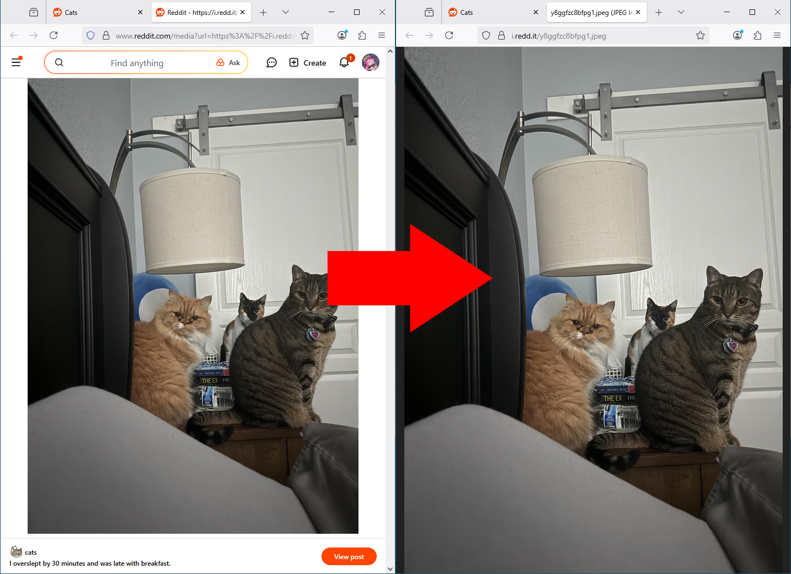

# No Reddit Image Viewer

By default, when opening an image from Reddit in a new tab, it will take you to its own
image viewer. With this extension, it will instead use the browser's buit-in image viewer.

## Building
You will need Python 3.x installed. After that, simply run the `package` script
(`package.cmd` on Windows). There will be ZIP files for both Manifest v2 and Manifest v3
in the `packaged` folder.

## Installation

### Chrome (or Chromium and forks)

1. Get the Manifest v3 ZIP file, either from [Releases](https://github.com/aubymori/no-reddit-image-viewer/releases/latest)
   or your own locally built copy.
2. Unzip it.
3. In your browser, go to `chrome://extensions`.
4. Make sure "Developer Mode" is enabled in the top right.
5. Drag the unzipped folder onto the page.

### Firefox (or forks)*

#### For debugging

1. Get the Manifest v2 or v3 ZIP file, either from [Releases](https://github.com/aubymori/no-reddit-image-viewer/releases/latest)
   or your own locally built copy.
2. In your browser, go to `about:debugging#/runtime/this-firefox`.
3. Select "Load Temporary Add-on...".
4. Select the previously obtained ZIP file. This will last only until you restart the browser.

#### From ZIP file**

1. Get the Manifest v2 or v3 ZIP file, either from [Releases](https://github.com/aubymori/no-reddit-image-viewer/releases/latest)
   or your own locally built copy.
2. In your browser, go to `about:config`.
3. Find `xpinstall.signatures.required`, and set it to false.
4. Restart your browser.
5. In your browser, go to `about:addons`.
6. Select the settings menu to the right of "Manage Your Extensions".
7. Select "Install Add-on From File...".
8. Select the previously obtained ZIP file.

*\*\*This method will only work on Firefox ESR, Dev Edition, Nightly, or forks.*.

*\*Before Firefox 140, you will need to use the `mv2-firefox-pre140` version.*